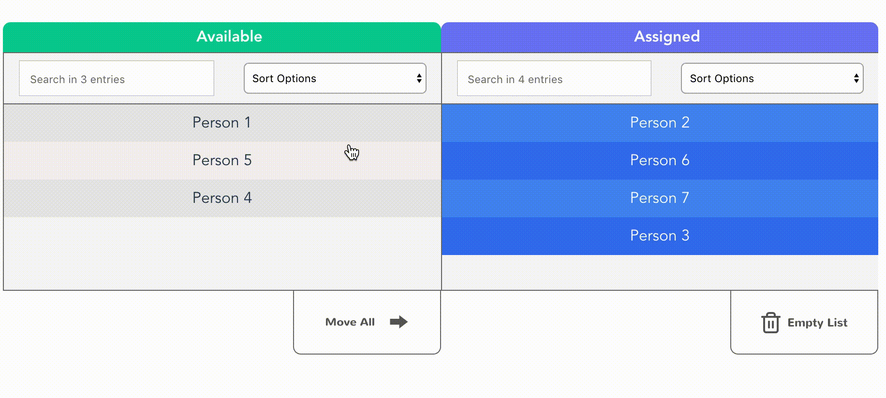
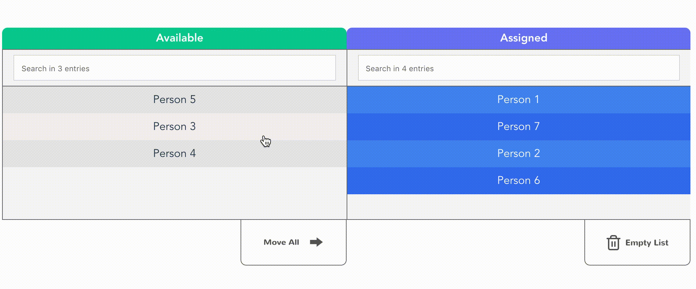

# VueMultiSelectionBox

> Yet another multi selection box for Vue

[](http://hits.dwyl.com/leventozen/vue-multiselection-box)

## Sorted mode



## Unsorted mode



# Demo

[Enjoy](https://codesandbox.io/embed/cool-https-sc1pk?fontsize=14&hidenavigation=1&theme=dark)

# Installation


NPM

```bash
npm i --save vue-multiselection-box
```

# Usage

## Script

```js
import MultiSelectionBox from "vue-multiselection-box";

export default {
  name: "App",
  components: {
    MultiSelectionBox
  },
  data: () => ({
    baseList: [
      { id: 1, name: "Person 1" },
      { id: 3, name: "Person 3" },
      { id: 4, name: "Person 4" },
      { id: 5, name: "Person 5" }
    ],
    selectedList: [
      { id: 2, name: "Person 2" },
      { id: 6, name: "Person 6" },
      { id: 7, name: "Person 7" }
    ],
    mappingOptions: {
      value: "name",
      key: "id"
    },
    leftSection: {
      text: "Available",
      styles: {
        backgroundColor: "#0acf97"
      },
      sortOption: null
    },
    rightSection: {
      text: "Assigned",
      styles: {
        backgroundColor: "#727df5"
      },
      sortOption: null
    },
    isSortable: false
  })
};

```
## Template

```html
<MultiSelectionBox
      :base-list="baseList"
      :selected-list="selectedList"
      :isSortable="true"
      :mappingOptions="mappingOptions"
      :leftSection="leftSection"
      :rightSection="rightSection"
      @updateBase="baseList = $event"
      @updateSelected="selectedList = $event"
/>
```
# Props API

| Props                       | Type              | Required | Default                     |
| --------------------------- | ----------------- | -------- | --------------------------- |
| baseList                    | Array             | no       | *                           |
| selectedList                | Array             | no       | **                          |
| isSortable                  | Boolean           | no       | True                        |
| mappingOptions              | Object            | no       | ***                         |
| leftSection                 | Object            | no       | ****                        |
| rightSection                | Object            | no       | *****                       |


(*) baseList : Is a base list for your selection box. (Left side.)

(**) selectedList : Is a selected list for your selection box. (Right side.)

(***) mappingOptions : is an object that holds information about your list items.

(****) leftSection : is an object that holds information about the heading color, heading text and initial sort option for your left box.

(*****) rightSection : is an object that holds information about the heading color, heading text and initial sort option for your right box.


## Authors

* **Levent Anil Ozen** - [leventozen](https://github.com/leventozen)
* **Can Agriboz** - [agriboz](https://github.com/agriboz)

# Upcoming features (Todo)

- Add more information for usage.
- Make it more customizable.
- Add tests
- Add drag and drop option


## Tests

Work in progress

# License

This project is licensed under [MIT License](http://en.wikipedia.org/wiki/MIT_License)
